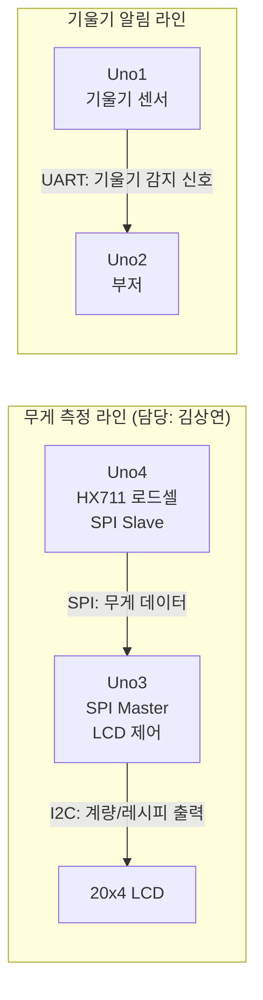

# 🍳 Chef Mate

> 1인가구를 위한 스마트 요리 보조 저울


---

## 📌 프로젝트 소개

Chef Mate는 요리 경험이 없는 1인가구 / 자취생을 위한 임베디드 시스템 기반 스마트 저울입니다.
LCD 화면에 레시피를 단계별로 안내하고, 실시간 무게 측정으로 정확한 계량을 도와줍니다.
스마트폰 없이도 위생적이고 빠르게 요리할 수 있습니다.

---

## 🎯 30초 프로젝트 소개 (담당: 김상연)

| 항목 | 내용 |
| --- | --- |
| 문제 | 요리 경험이 부족한 1인가구·자취생은 계량과 조리 순서를 동시에 신경 쓰기 어렵다 |
| 역할 | 무게 측정(HX711) 로직 + LCD UI 코드 작성, **Uno3(Master) ↔ Uno4(Slave) SPI 통신** 설계 |
| 선택 | 보드별 역할을 SPI/I2C/UART로 분리해 각 Uno가 단일 책임(무게측정 / UI / 기울기·알람)만 갖도록 설계 |
| 결과 | HX711 기반 0.1g 단위 실시간 계량 값을 SPI로 LCD 보드에 전달, 20x4 LCD에 레시피·계량 단계 출력 |

---

## 🎬 Demo — 시연 영상

<video src="demo/1번.mp4" controls width="100%"></video>

---

## ⚙️ 주요 기능

- 📏 **실시간 무게 측정** — HX711 로드셀 센서로 0.1g 단위 계량
- 📺 **LCD 레시피 안내** — 20x4 LCD에 단계별 조리 과정 출력
- ⏱️ **조리 타이머** — 단계별 자동 타이머 + 부저 알람
- 🔘 **버튼 네비게이션** — 스마트폰 없이 버튼만으로 조작

---

## 🔌 통신 구조

| 통신 | 연결                          | 역할                     |
| ---- | ----------------------------- | ------------------------ |
| SPI  | Uno3 (Master) ↔ Uno4 (Slave) | 무게 데이터 요청 및 수신 |
| I2C  | Uno3 ↔ LCD                   | 측정값 화면 출력         |
| UART | Uno1 ↔ Uno2                  | 기울기 감지 → 부저 알림 |

### 구조도



> **해석**: 보드 4개를 "무게 측정 → 화면 출력" 라인과 "기울기 감지 → 알림" 라인 두 그룹으로 분리했습니다.
> 김상연이 담당한 영역은 Uno3↔Uno4 사이의 **SPI Master-Slave 통신**과, Uno3에서 LCD로 보내는 **I2C 출력**입니다.

---

## 📁 파일 구조

```
Embedded_System_ChefMate/
├── SPI_Master_LCD.ino   # Uno3 - UI 총괄, SPI Master, LCD 제어
├── SPI_Slave.ino        # Uno4 - 무게 측정, SPI Slave
├── UART_Buzzer.ino      # Uno2 - UART 수신, 부저 제어
├── demo/
│   └── 1번.mp4          # 시연 영상
└── images/
    └── ChefMate_images.jpeg
```

> ℹ️ **Uno1(기울기 센서, UART 송신) 코드는 현재 본 저장소에 포함되어 있지 않습니다.**
> 해당 코드는 이재진 / 김종원 팀원이 관리 중입니다. <!-- TODO: 실제 보관 위치(별도 저장소/팀 공유 폴더 등)로 링크 추가 -->

---

## 🚀 실행 가이드 (Quick Start)

### 1) 필요 라이브러리 설치 (Arduino IDE)

| 라이브러리 | 용도 | 설치 방법 |
| --- | --- | --- |
| `Wire` | I2C 통신 (LCD) | 기본 내장, 설치 불필요 |
| `LiquidCrystal_I2C` | 20x4 I2C LCD 제어 | Library Manager에서 "LiquidCrystal I2C" 검색 후 설치 |
| `SPI` | Uno3↔Uno4 통신 | 기본 내장, 설치 불필요 |
| `HX711` | 로드셀 무게 측정 | Library Manager에서 "HX711" 검색 후 설치 |
| `SoftwareSerial` | UART (Uno1↔Uno2) | 기본 내장, 설치 불필요 |

### 2) 보드별 업로드 매핑

| 보드 | 업로드할 파일 | 비고 |
| --- | --- | --- |
| Uno3 | `SPI_Master_LCD.ino` | LCD, 버튼, SPI Master |
| Uno4 | `SPI_Slave.ino` | HX711 로드셀, SPI Slave |
| Uno2 | `UART_Buzzer.ino` | 부저, UART 수신 |
| Uno1 | (별도 관리) | 기울기 센서, UART 송신 — 위 파일 구조 안내 참고 |

### 3) 실행 순서

1. 각 Arduino Uno에 위 표에 따라 `.ino` 파일 업로드
2. 배선: Uno3↔Uno4 SPI 핀(SS/MOSI/MISO/SCK) 연결, Uno3↔LCD I2C(SDA/SCL) 연결 <!-- TODO: 실제 핀 연결도/사진 추가 -->
3. Uno4(SPI Slave) 먼저 전원 인가 → Uno3(SPI Master) 전원 인가
4. LCD에 메뉴(`menuItems`)가 출력되면 버튼으로 메뉴 선택 → 무게 측정값이 0.1g 단위로 갱신되는지 확인

### 4) 자주 발생하는 문제

| 증상 | 원인 / 해결 |
| --- | --- |
| LCD에 아무것도 안 뜸 | I2C 주소(`0x27`)가 보드와 다를 수 있음 → I2C 스캐너로 주소 재확인 |
| 무게 값이 0 또는 이상치 | `CALIBRATION_FACTOR`(`-7050.0`)가 실제 로드셀과 다름 → 보정 필요 (아래 트러블슈팅 참고) |

---

## 🛠️ 하드웨어 구성

- Arduino Uno x 4
- HX711 + 로드셀 (무게 센서)
- LCD 2004 (20x4 I2C)
- 피에조 부저
- 기울기 센서
- 버튼 모듈 x 3
- 아크릴 케이스

---

## 🧠 기술적 의사결정 (Trade-off)

| 선택 | 대안 | 선택 이유 | 포기한 점 |
| --- | --- | --- | --- |
| Uno3↔Uno4 간 **SPI** 통신으로 무게 데이터 전달 | I2C, UART | LCD(I2C)·기울기(UART) 라인과 분리해 통신 충돌 방지, Master-Slave 구조로 무게 측정 보드를 독립적으로 운용 | SPI는 SS/MOSI/MISO/SCK 4선 배선이 필요해 I2C/UART보다 배선 복잡도가 높음 |
| LCD는 **I2C**로 Uno3에 연결 | SPI, 병렬(Parallel) LCD | 핀 수가 적게 들어 다른 통신(SPI)과 핀 경합을 줄임 | I2C 버스 속도 한계로 화면 갱신 빈도 제한 |
| 로드셀 보정값 `CALIBRATION_FACTOR = -7050.0` | 라이브러리 기본값 사용 | <!-- TODO: 실측 보정 절차(기준 무게, 측정값, 계산 과정)를 채워주세요 --> | <!-- TODO: 보정 시 포기한 정밀도/시간 등 --> |

> ✏️ 위 표의 `<!-- TODO -->` 항목은 실제 작업 내용으로 채워 넣으면 면접에서 "왜 이 값을 썼는지" 질문에 바로 근거로 쓸 수 있습니다.

---

## 🔧 트러블슈팅 (STAR)

### 사례 1: SPI Master-Slave 무게 데이터 동기화 <!-- TODO: 실제 겪은 문제로 교체 -->

| 항목 | 내용 |
| --- | --- |
| **S**ituation | <!-- 예: Uno3(Master)가 Uno4(Slave)로부터 받은 무게 값이 간헐적으로 0 또는 이전 값으로 표시됨 --> |
| **T**ask | <!-- 예: SPI 통신 타이밍 문제인지, HX711 측 read 시점 문제인지 원인을 분리해야 했음 --> |
| **A**ction | <!-- 예: Serial 출력으로 Slave 측 weightBuffer 값과 Master 측 수신값을 비교, SPI 전송 주기와 HX711 read 주기를 맞춤 --> |
| **R**esult | <!-- 예: 동기화 이후 동일 조건에서 값 누락 재현되지 않음을 확인, 측정 주기를 README에 문서화 --> |

> ✏️ 실제로 겪었던 문제(예: HX711 보정 과정, LCD I2C 주소 충돌, 버튼 디바운싱 등)로 위 내용을 교체해 두면
> 30초 소개에서 언급한 "역할"에 대한 면접 근거 링크로 바로 쓸 수 있습니다.

---

## 👥 팀원

| 이름   | 역할                                               |
| ------ | -------------------------------------------------- |
| 김윤후 | 무게 센서 코드, LCD 코드, I2C 통신, 버튼 모듈      |
| 이재진 | LCD 코드, 프레임 제작, 기울기 알고리즘 및 하드웨어 |
| 김상연 | 무게/LCD 코드, SPI 통신 설계                       |
| 김종원 | 기울기/부저 코드, UART 통신 설계                   |

---

> 임베디드시스템 기말발표 4조 (2025)
