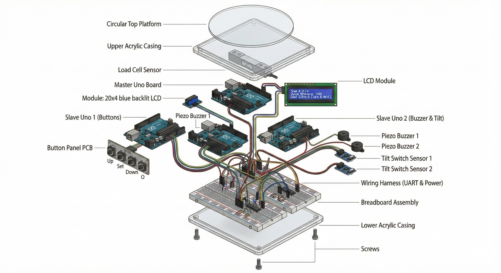
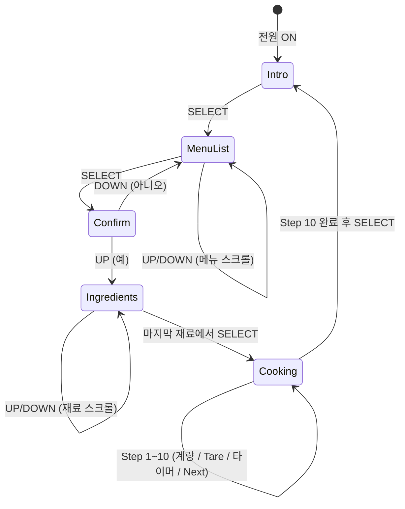
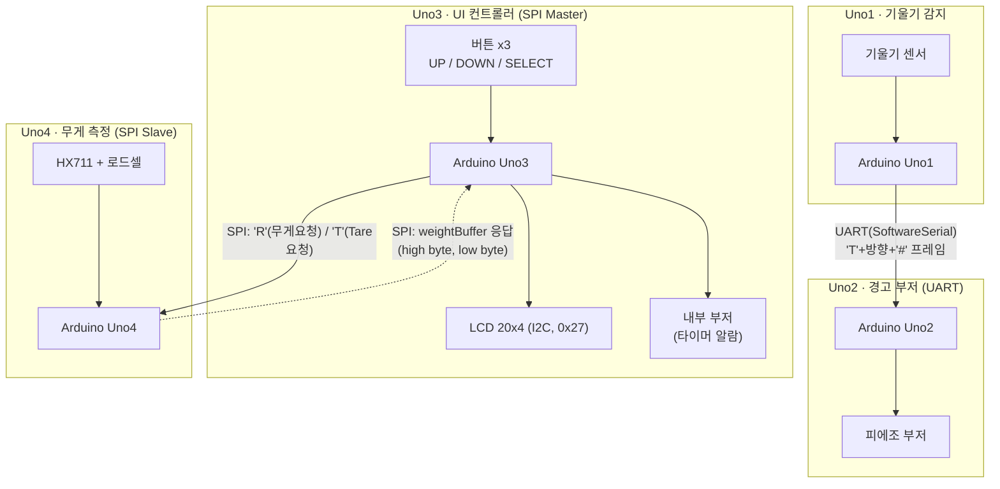
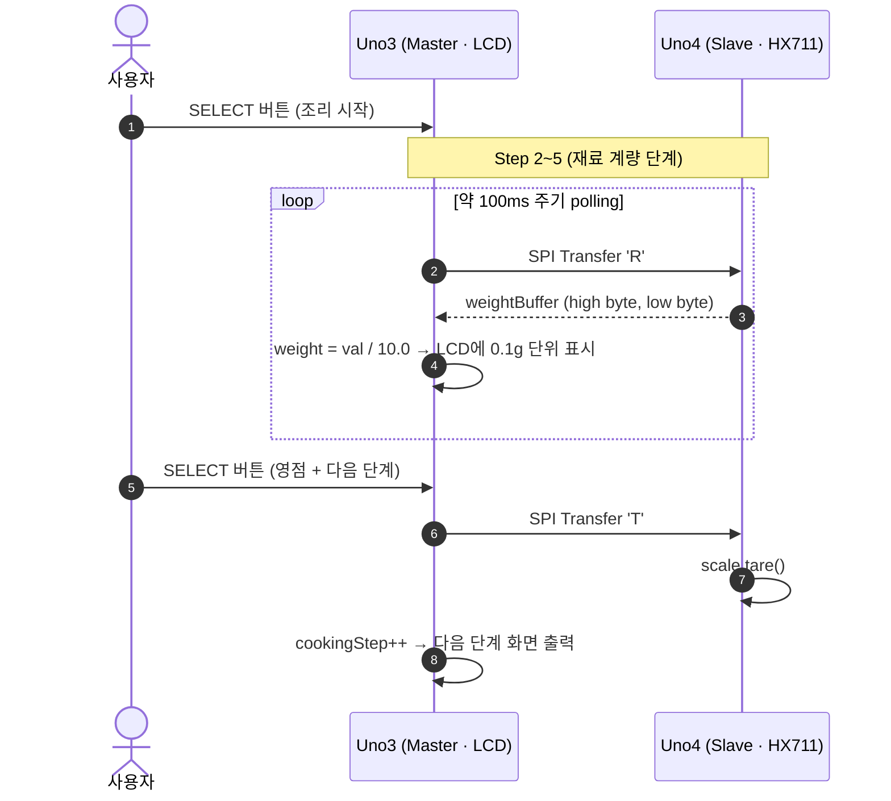

# 🍳 ChefMate — 1인가구를 위한 스마트 요리 보조 저울

> 요리 경험이 없는 자취생이 **레시피 진행 + 정확한 계량 + 타이머 알림**을 한 번에 놓치지 않도록 돕는 4-MCU 임베디드 시스템

[]()
[]()
[]()
[]()

**🙋 역할 (김상연):** 무게 센서 처리(SPI Slave) · LCD UI/메뉴(SPI Master) · I2C/SPI 통신 · 버튼 네비게이션

**✅ 핵심 기능 4개:** 📏 0.1g 실시간 계량 · 📺 LCD 단계별 레시피 안내 · ⏱️ 자동 타이머+알람 · 🚨 기울기 감지 알림

**🛠️ Stack:** Arduino Uno x4 · HX711 · SPI / I2C / UART · LiquidCrystal_I2C · C++

| 더 보기 | 미리보기 |
|---|---|
| 🎬 [Demo](#-demo--실행-화면) | LCD 화면 흐름(상태 다이어그램)으로 사용자 경험 확인 |
| ⚙️ [Features](#-features--전체-기능) | 핵심 기능 4개 + 보조 기능 2개 전체 설명 |
| 🏗️ [Architecture](#-architecture--시스템-구조) | 4-Uno 통신 구조, SPI 요청/응답 시퀀스, 기술 의사결정(Trade-off) |
| 🛠️ [RunBook](#-runbook--빌드--실행-가이드) | 배선표 · 라이브러리 · 업로드 순서 · HX711 보정 절차 |
| 🧪 [Troubleshooting](#-troubleshooting-star) | HX711 음수값 처리 등 STAR 형식 트러블슈팅 사례 |

---



---

## 🦸 Hero — 프로젝트 한눈에 보기

**무엇을, 누구를 위해, 어떻게 해결했는가**

요리 경험이 없는 1인가구·자취생은 레시피를 보면서 동시에 정확히 계량하기 어렵고, 결국 배달 음식에 의존하게 됩니다.
ChefMate는 **무게 센서 + LCD 메뉴 + 버튼 + 타이머/부저**를 하나의 흐름으로 묶어, 스마트폰 없이도 손에 들고 바로
요리를 시작할 수 있는 임베디드 디바이스입니다.

**개발 목적 및 목표**
- 요리 경험이 부족한 사용자도 정확한 계량과 단계 안내를 통해 요리를 성공할 수 있도록 지원
- 배달 음식 의존도를 낮추고 건강한 식습관 형성을 유도
- 직관적인 UI/UX로 누구나 쉽게 사용할 수 있는 스마트 주방 디바이스 구현

**핵심 기능 4개**
| 기능 | 설명 |
|---|---|
| 📏 실시간 무게 측정 | HX711 로드셀로 0.1g 단위 계량, SPI로 LCD에 즉시 표시 |
| 📺 LCD 단계별 레시피 안내 | 메뉴 선택 → 재료 안내 → 조리 단계까지 20x4 LCD 한 화면에서 진행 |
| ⏱️ 조리 타이머 + 자동 알람 | 예열/조리/뒤집기 단계마다 자동 카운트다운 후 부저로 알림 |
| 🚨 기울기 감지 안전 알림 | 조리 도구가 기울면 별도 보드의 부저로 즉시 경고 |

**기술 스택 & 역할**
| 구분 | 내용 |
|---|---|
| 하드웨어 | Arduino Uno x4, HX711+로드셀, LCD 2004(I2C), 피에조 부저 x2, 기울기 센서, 버튼 x3 |
| 통신 | SPI(무게 데이터 요청/응답), I2C(LCD), UART(기울기 → 부저) |
| 언어 | C++ (Arduino) |
| **내 역할 (김상연)** | 무게 센서 처리(SPI Slave), LCD UI/메뉴 로직(SPI Master), I2C 통신, 버튼 네비게이션 |

🔗 **탐색 경로:** [Demo](#-demo--실행-화면) → [Features](#-features--전체-기능) → [Architecture](#-architecture--시스템-구조) → [RunBook](#-runbook--빌드--실행-가이드) → [Troubleshooting](#-troubleshooting-star)

---

## 🎬 Demo — 실행 화면

> 본 프로젝트는 **하드웨어 디바이스**라 배포 URL이 없습니다. 대신 LCD 화면 흐름(상태 다이어그램)으로
> 사용자가 실제로 어떤 화면을 거쳐 요리를 완료하는지 보여줍니다. 직접 실행해보려면 [RunBook](#-runbook--빌드--실행-가이드)을 따라주세요.
>
> 📹 **시연 영상/GIF**: `[여기에 동작 영상 링크 추가 예정]`



| 화면 상태 | LCD에 보이는 것 | 담당 함수 |
|---|---|---|
| Intro | "Would you like to start cooking?" | `showIntro()` |
| MenuList | 7개 메뉴(된장국~불고기) 4줄 스크롤 목록 | `drawMenu()` |
| Confirm | "Do you want to make {메뉴}?" Yes/No | `showYesNoQuestion()` |
| Ingredients | 선택한 메뉴의 재료 목록 4줄 스크롤 | `drawIngredients()` |
| Cooking | Step 1~10 안내 + 실시간 무게/타이머 | `processCookingStep()` |

---

## ⚙️ Features — 전체 기능

위 4개 핵심 기능 외에 아래 2개 기능이 전체 흐름을 보조합니다.

- 📏 **실시간 무게 측정** — HX711 로드셀로 0.1g 단위 계량, SPI 통신으로 Master에 전달
- 📺 **LCD 레시피 안내** — 메뉴 선택 → 재료 안내 → 단계별 조리 과정을 20x4 I2C LCD에 출력
- ⚖️ **단계별 Tare(영점) 처리** — 재료를 올릴 때마다 버튼으로 영점 조정 후 다음 단계로 진행
- ⏱️ **조리 타이머 + 부저 알람** — 예열/조리/뒤집기 단계에 자동 타이머와 알람 부착
- 🚨 **기울기 감지 알림** — 조리 도구 기울어짐 감지 시 UART로 별도 보드의 부저를 울려 경고
- 🔘 **버튼 3개 네비게이션** — UP/DOWN/SELECT 버튼만으로 메뉴 탐색부터 조리 진행까지 전부 조작

---

## 🏗️ Architecture — 시스템 구조

4개의 Arduino Uno는 각자의 입출력 장치를 책임지고, **SPI**와 **UART** 두 통신선으로 연결됩니다.



> **해석:** UI/입력은 Uno3가 전담하고, 무게 측정은 Uno4에 위임해 SPI로 polling 합니다.
> 기울기 감지(Uno1)와 경고 부저(Uno2)는 메인 흐름과 분리된 안전 경고 채널로 UART를 사용합니다.

### 무게 측정 요청/응답 흐름 (조리 단계 2~5)



> **해석:** SPI는 Master가 'R'/'T' 1바이트 커맨드를 보내는 **Master 주도 polling 프로토콜**입니다.
> Slave는 인터럽트(`SPI_STC_vect`)로만 응답하므로, Master의 요청 주기가 곧 무게 갱신 주기를 결정합니다.

### 기술 의사결정 (Trade-off)

| 주제 | 선택 | 대안 | 선택 이유 | 포기한 점 | 검증 방법 |
|---|---|---|---|---|---|
| 보드 분리 구조 | 기능별 Uno 4대 분리 (UI/무게/기울기/부저) | Mega 1대로 통합 | 팀원별 독립 개발·동시 테스트 가능, 보드당 I/O 핀 여유 확보 | 보드 간 통신(SPI/UART) 오버헤드, 배선·전원 복잡도 증가 | 각 보드 단독 업로드 후 개별 기능(LCD 출력, 무게 측정, 부저) 확인 |
| Master-Slave 무게 통신 | SPI ('R'/'T' 1바이트 커맨드 + 인터럽트 응답) | I2C 또는 UART | Master가 필요한 시점에만 polling, Slave는 인터럽트(`SPI_STC_vect`)만으로 응답 가능해 부담 적음 | SS 배선 추가 필요, 체크섬 없어 노이즈에 취약 | LCD 표시 무게값과 실측 무게(알려진 물체) 비교 |
| 기울기→부저 통신 | UART (`SoftwareSerial`, `'T'+방향+'#'` 프레임) | 무선(블루투스/RF) | 인접 보드 간 유선 연결로 비용·복잡도 최소화 | 거리 제약, SoftwareSerial 인터럽트 충돌 가능성 | 기울기 발생 시 부저 알림까지의 지연 측정 |
| HX711 보정값 관리 | 코드 내 상수(`CALIBRATION_FACTOR = -7050.0`) 하드코딩 | EEPROM 저장 + 런타임 보정 루틴 | 발표 일정 내 구현 범위를 좁혀 핵심 기능(계량+UI)에 집중 | 로드셀 교체/온도 변화 시 재컴파일 필요 → 재현성 저하 | 알려진 무게의 물체로 표시값-실측값 오차 확인 |
| 무게값 음수 처리 | `if (w < 0) w = 0.0;` 클램핑 (Slave/Master 양쪽) | 음수 허용 후 UI에서 별도 처리 | Tare 직후 노이즈로 음수가 나올 때 LCD에 비정상 값이 보이는 것을 방지 | 실제 음수(센서 이상)와 노이즈를 구분하지 못함 | Tare 직후 무게 변화 로그로 음수 빈도 확인 |

---

## 🛠️ RunBook — 빌드 & 실행 가이드

> ⚠️ 기존 README에는 빌드/업로드 절차가 없어 "문서만 보고 재현"이 불가능했습니다. 아래 절차를 따라 새 환경에서도
> 동일하게 동작하는지 검증한 뒤, 막힌 부분은 [Troubleshooting](#-troubleshooting-star) 섹션에 계속 추가해 주세요.

### 1) 필요 하드웨어

| 부품 | 수량 | 비고 |
|---|---|---|
| Arduino Uno | 4 | Uno1(기울기) / Uno2(부저) / Uno3(UI·LCD, Master) / Uno4(무게, Slave) |
| HX711 + 로드셀 | 1 | Uno4에 연결 |
| LCD 2004 (20x4, I2C) | 1 | I2C 주소 `0x27`, Uno3에 연결 |
| 피에조 부저 | 2 | Uno3 내부 알람용 1개, Uno2 경고용 1개 |
| 기울기 센서 | 1 | Uno1에 연결 |
| 버튼 모듈 | 3 | UP / DOWN / SELECT, Uno3에 연결 |
| 점퍼 케이블 / 브레드보드 / 아크릴 케이스 | - | - |

### 2) 핀 연결표

**Uno3 (SPI Master · LCD/버튼)**

| 핀 | 연결 | 코드 정의 |
|---|---|---|
| D5 | UP 버튼 (INPUT_PULLUP) | `UP_BTN` |
| D6 | DOWN 버튼 (INPUT_PULLUP) | `DOWN_BTN` |
| D7 | SELECT 버튼 (INPUT_PULLUP) | `SELECT_BTN` |
| D8 | 내부 부저 (타이머 알람) | `BUZZER_PIN` |
| D10 | SPI SS → Uno4 SS | `SS_PIN` |
| D11/D12/D13 | SPI MOSI/MISO/SCK → Uno4 | (SPI 하드웨어 고정 핀) |
| A4(SDA)/A5(SCL) | LCD 20x4 (I2C, `0x27`) | `Wire` / `LiquidCrystal_I2C` |

**Uno4 (SPI Slave · 무게 측정)**

| 핀 | 연결 | 코드 정의 |
|---|---|---|
| D2 | HX711 CLK | `CLK_PIN` |
| D3 | HX711 DOUT | `DOUT_PIN` |
| D10/D11/D12/D13 | SPI SS/MOSI/MISO/SCK ← Uno3 | (SPI 하드웨어 고정 핀, `MISO`는 `OUTPUT`으로 설정) |

**Uno2 (UART · 경고 부저)**

| 핀 | 연결 | 코드 정의 |
|---|---|---|
| D4 | SoftwareSerial RX ← Uno1 TX | `SoftwareSerial mySerial(4, 2)` |
| D2 | SoftwareSerial TX (미사용/예비) | 〃 |
| D8 | 경고 부저 | `pinBuzzer` |

**Uno1 (기울기 감지 → UART 송신)**

> 🚧 **현재 저장소에 Uno1 코드가 없습니다.** README의 통신 구조(`UART: Uno1 ↔ Uno2`)와 실제 파일 구성이
> 불일치하는 상태입니다. → [향후 개선](#-향후-개선-issue-후보) 1순위 참고

### 3) 필요 라이브러리 (Arduino IDE 라이브러리 매니저)

```text
Wire                  (내장)
SPI                   (내장)
SoftwareSerial        (내장)
LiquidCrystal_I2C     (Frank de Brabander 또는 호환 버전)
HX711                 (bogde/HX711)
```

### 4) 업로드 순서

```text
1. SPI_Slave.ino      → Uno4 (무게 측정 보드) 업로드
2. SPI_Master_LCD.ino → Uno3 (UI/LCD 보드) 업로드
3. UART_Buzzer.ino    → Uno2 (경고 부저 보드) 업로드
4. (Uno1 기울기 코드)  → Uno1 업로드  ※ 코드 추가 필요
```

> Slave를 먼저 올려 SPI 인터럽트가 항상 대기 상태인지 확인한 뒤 Master를 연결하면,
> 첫 `getWeightFromSlave()` 호출부터 정상 응답을 받을 수 있습니다.

### 5) HX711 보정 (Calibration)

`SPI_Slave.ino`의 `CALIBRATION_FACTOR = -7050.0`은 **현재 사용 중인 로드셀에 맞춰 하드코딩된 값**입니다.

```text
1. 로드셀 위에 아무것도 올리지 않은 상태에서 scale.tare() 실행 (코드에 이미 포함)
2. 무게를 알고 있는 물체(예: 500ml 물병 = 약 500g)를 올린다
3. LCD에 표시되는 값과 실제 무게가 같아지도록 CALIBRATION_FACTOR를 조정한다
4. 값이 맞춰질 때까지 2~3회 반복 후 재업로드
```

### 6) 정상 동작 확인 체크리스트

- [ ] 전원 인가 후 LCD에 "Would you like to start cooking?" 인트로 화면이 표시되는가?
- [ ] SELECT 버튼으로 메뉴 진입 → UP/DOWN으로 7개 메뉴 스크롤이 되는가?
- [ ] 메뉴 선택 후 재료 목록(`ingredients`)이 정상 출력되는가?
- [ ] Step 2~5에서 로드셀에 물체를 올리면 LCD 무게값이 변하는가?
- [ ] SELECT(Tare) 시 무게가 0으로 재설정되고 다음 단계로 넘어가는가?
- [ ] Step 7~9 타이머가 카운트다운되고 종료 시 부저(`playAlarm`)가 울리는가?
- [ ] 기울기 센서 동작 시 Uno2 부저가 울리는가? (Uno1 코드 추가 후 확인)

---

## 🧪 Troubleshooting (STAR)

> 아래는 코드에 남은 흔적(`if (w < 0) w = 0.0;` 클램핑)을 바탕으로 작성한 **예시 초안**입니다.
> 실제 겪었던 상황의 수치·로그로 S/T/A/R을 채워 면접 답변으로 바로 쓸 수 있게 다듬어 주세요.

### 예시 1: HX711 음수 무게값 처리

| 항목 | 내용 |
|---|---|
| **S (상황)** | Tare(영점 설정) 직후 또는 로드셀에 아무것도 없을 때 `scale.get_units()` 값이 간헐적으로 음수로 나와 LCD에 `-0.3g` 같은 비정상 값이 표시됨 |
| **T (과제)** | 사용자가 보는 화면에는 음수 무게가 보이지 않아야 하고, Master-Slave 간 전달되는 정수 버퍼(`weightBuffer`)도 안전한 범위여야 함 |
| **A (행동)** | Slave에서 `get_units()` 결과를 정수 버퍼로 변환하기 전 `if (w < 0) w = 0.0;`로 클램핑, Master에서도 수신값에 동일하게 방어 처리 추가 |
| **R (결과)** | _(채워주세요)_ 어떤 조건에서 재현했고, 적용 후 동일 조건에서 음수가 다시 발생하지 않음을 어떻게 확인했는지 |

### 예시 2: SPI Master-Slave 타이밍 (작성 가이드)

| 항목 | 내용 |
|---|---|
| **S** | `getWeightFromSlave()`에서 `delayMicroseconds(100)`만큼 대기 후 응답을 읽음 — 이 지연이 짧거나 길었을 때 어떤 문제가 있었는지 |
| **T** | 안정적으로 high/low byte를 읽기 위한 최소 대기 시간 파악 |
| **A** | 어떤 값으로 테스트했고, 어떤 기준(LCD 값 튐, 응답 없음 등)으로 판단했는지 |
| **R** | 최종 값과 재현 절차 |

---

## 🔗 협업 기록 (Issue / PR)

현재 커밋 히스토리가 `first commit → remove .DS_Store → add hardware images → add README → fix README location → Update README.md`
로만 구성되어 있어, **기능 구현·디버깅 과정에 대한 작업 맥락(Issue/PR)이 README에서 보이지 않는 상태**입니다.

아래 Issue를 실제로 생성하고, 작업 후 PR에 `Closes #번호` 형식으로 연결하면 이 표를 실제 링크로 채워주세요.

| Issue/PR | 무엇을 보여주는가 | 상태 |
|---|---|---|
| `#1 docs: RunBook(빌드/업로드 가이드) 추가` | 재현 가능한 실행 문서화 능력 | ⬜ 예정 |
| `#2 feat: Uno1 기울기 센서 코드 추가 및 문서 정합화` | 문서-저장소 불일치 해결, 시스템 완성도 | ⬜ 예정 |
| `#3 fix: HX711 보정 루틴 추가 (하드코딩 → 절차화)` | 트러블슈팅·검증 능력 | ⬜ 예정 |
| `#4 docs: Hero/Architecture/Trade-off README 재구성` | 평가자 탐색 경로 설계, 공학적 의사결정 근거 | ✅ 본 PR에서 반영 |

---

## 👥 팀원 및 역할

| 이름 | 역할 | 기술적 기여 |
|---|---|---|
| **김상연** | 무게 센서 코드, LCD 코드, I2C 통신, 버튼 모듈 | HX711 SPI Slave 로직, SPI Master LCD/메뉴 상태머신, 영점(Tare) 흐름 설계 |
| 이재진 | LCD 코드, 프레임 제작, 기울기 알고리즘 및 하드웨어 | 케이스 설계, 기울기 감지 로직 |
| 김윤후 | 무게/LCD 코드, SPI 통신 설계 | SPI 프로토콜('R'/'T' 커맨드) 설계 |
| 김종원 | 기울기/부저 코드, UART 통신 설계 | UART 프레임(`'T'+방향+'#'`) 설계, 부저 제어 |

---

## 🚀 향후 개선 (Issue 후보)

수업 후 바로 만들 수 있는 작업 단위로 정리했습니다. 우선순위 순서대로 Issue를 생성해 주세요.

1. **[1순위] RunBook 실행성 확보** — 빌드/업로드/보정 가이드를 README에 반영 ✅ (본 PR에서 작성, 실제 보드로 재검증 필요)
2. **[2순위] Architecture 깊이 보강** — Mermaid 아키텍처/시퀀스/Trade-off 작성 ✅ (본 PR에서 작성)
3. **[3순위] 저장소-문서 정합화 + 협업 기록** — 누락된 Uno1 기울기 센서 코드 추가, Conventional Commits(`feat:`/`fix:`/`docs:`) 적용, 위 Issue/PR 표를 실제 링크로 채우기 ⬜ (다음 작업)
4. **[향후] Demo 영상 추가** — LCD 화면 흐름을 실제 시연 영상/GIF로 촬영해 Demo 섹션에 추가 ⬜

---

## 📁 파일 구조

```text
Embedded_System_ChefMate/
├── SPI_Master_LCD.ino   # Uno3 - UI 총괄, SPI Master, LCD/버튼/타이머
├── SPI_Slave.ino        # Uno4 - HX711 무게 측정, SPI Slave
├── UART_Buzzer.ino      # Uno2 - UART 수신, 경고 부저
├── (Uno1 기울기 코드)    # ⚠️ 아직 없음 - Issue #2 참고
└── images/
    └── ChefMate_images.jpeg
```

---

> 임베디드시스템 기말발표 4조 (2025)
